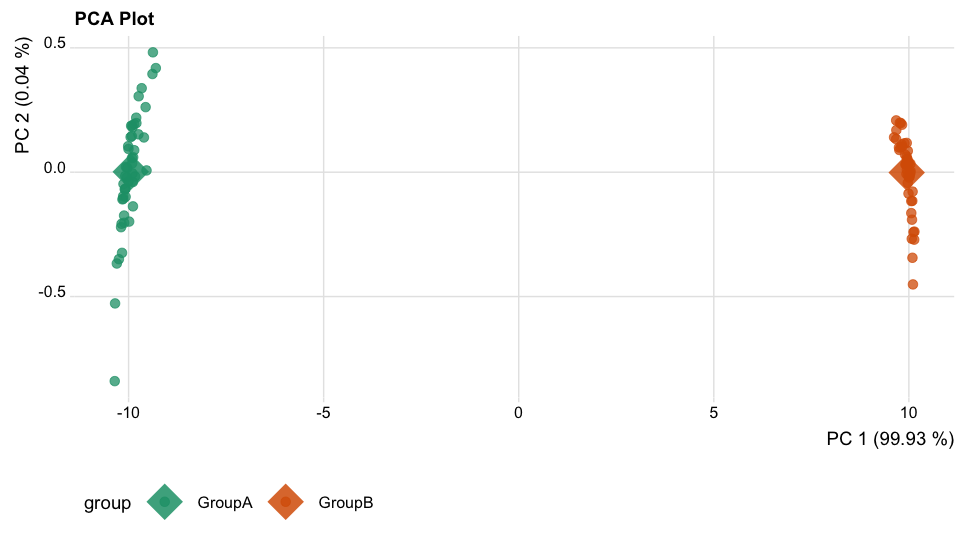
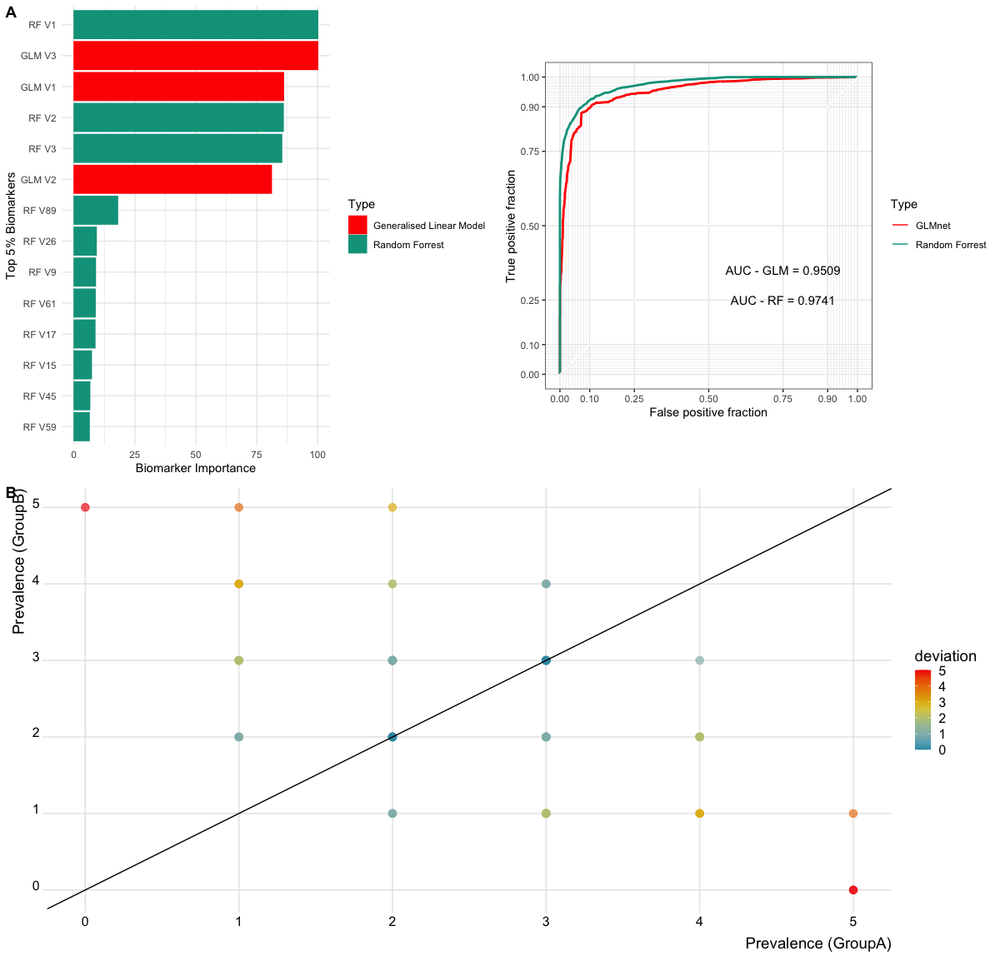
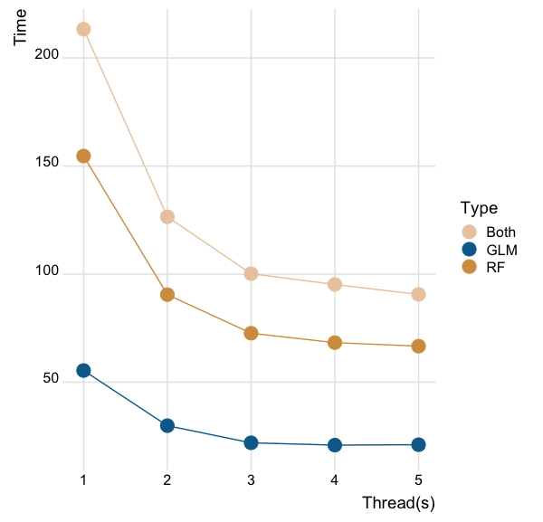
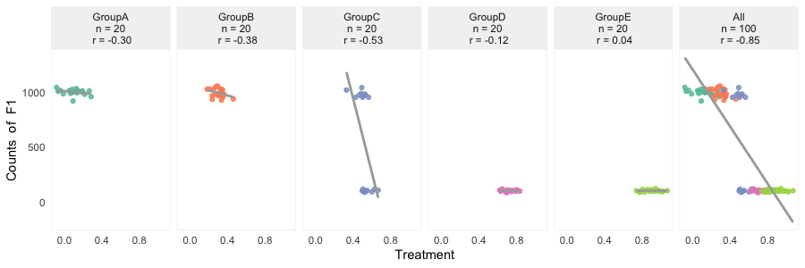

# Basic R functions for visualization of multi-variate analysis

*Currently this haven't been made to an R-package, but we are on it*

This repository contains a basic R scripts (functions) that can be used for analyzing multi-variate analysis from bacteria and host-microbe interactions using omics data. 

## Visualization Features
The R functions is thoroughly documented, providing explanations and examples for each function to facilitate its usage and customization. 
Main functions includes preprocessing multi-variate data from omics, such as filtering, normalization, and transformation. Furthermore, it offers various statistical analysis methods for identifying important feature in the dataset. Key functions are listed below.

- **Data overview**: A function getting an overview of features in dataset, either individually or across groups of interest. 
  
- **Preprocessing**: A function for preprocessing omics data, such as quality control, filtering, normalization, and transformation.

- **Collector's curves**: A function for investigating sufficient data collection.
  
- **Sample-size based extrapolation of richness in data**: The script is thoroughly documented, providing explanations and examples for each function to facilitate its usage and customization.

- **Boxplots and statistical comparison of groups**: A function statistical and visual comparison of features between groups

- **Composition of features, using barplots**: A function for generating the barplot, which always are used in microbiome studies. Here you can group samples per group, if you like.

- **Composition analysis, using Principal component analysis (PCA)**: If you know, you know.

- **Biomarker predictions, using GLMs or fancy RF**: If you know, you know.
  
- **Linear mixed effect models**: If you know, you know.


## Tutorial
For reproducability purposes I generated a function for generating sandbox data. The output is a list of two dataset. A abundance matrix and a sample information sheet. 

```{R}
# Get function
source("https://raw.githubusercontent.com/JacobAgerbo/Basic_Utils/main/Visualization/make_test_data.R")

# Make data
data_list <- make_test_data(100)
# Export from list to datasets
abundance_data <- data_list$data
sample_data <- data_list$sample_data
```

### Data overview

```

```

### Preprocessing

```

```

### Collector's curves
Here we produce collector's curves for four random samples. Using random subsampling 20 times. The bold black line indicates the mean of all subsampling.
```
# get function
source("https://raw.githubusercontent.com/JacobAgerbo/Basic_Utils/main/Visualization/make_collectors_curves.R")

# generate collector's curves
make_collectors_curves(data = data, interations = 20)
```


### Sample-size based extrapolation of richness in data
This is based on the iNEXT *R package*

```
# get function
source("https://raw.githubusercontent.com/JacobAgerbo/Basic_Utils/main/Visualization/make_iNEXT.R")

# generate iNEXT figure
do_iNEXT(data = data, sample_data = sample_data, group_var = "O_Group")
```


### Boxplots and statistical comparison of groups
Generate boxplots across different group. Here you can add statistics. Homogeneity will automatically be tested and will be basis for parametric or non-parametric test.

Here I will just generate some nominal normal distributed data, which is better for this purpose.
```
# generate 50x100 matrix of random data for the first half
first_half <- matrix(rnorm(5000, mean = 10, sd = 1.2), nrow = 100, ncol = 50)
# generate 50x100 matrix of random data for the second half
second_half <- matrix(rnorm(5000, mean = 5, sd = .2), nrow = 100, ncol = 50)

# combine the two halves vertically
data <- cbind(first_half, second_half)
```
But same procedure. Get function and launch. :) 

```
# get function
source("https://raw.githubusercontent.com/JacobAgerbo/Basic_Utils/main/Visualization/make_boxplot.R")

# generate boxplots
generate_boxplot(data = abundance_data, 
                 sample_data = sample_data, 
                 group_var = "O_Group", 
                 test = TRUE, 
                 violin = FALSE, 
                 jitter = FALSE, 
                 palette = "Dark2") # Dark2 is the default palette
```


### Composition of features, using barplots
```
# generate some taxa data 
tax_data <- data.frame("Phylum"= c(rep(c("PhyA", "PhyB", "PhyC", "PhyD", "PhyE"), each = 20),rep(c("PhyA", "PhyB", "PhyC"), each = 1)),
                      "Order"= c(rep(c("OrdA", "OrdB", "OrdC", "OrdD", "OrdE"), each = 20), rep(c("OrdA", "OrdB", "OrdC"), each = 1)),
                      "Class"= c(rep(c("ClassA", "ClassB", "ClassC", "ClassD", "ClassE"), each = 20),rep(c("ClassA", "ClassB", "ClassC"), each = 1)),
                      "Family"= c(rep(c("FamA", "FamB", "FamC", "FamD", "FamE"), each = 20),rep(c("FamA", "FamB", "FamC"), each = 1)),
                      "Genus"= c(rep(c("GenA", "GenB", "GenC", "GenD", "GenE", "GenF", "GenG", "GenH", "GenI",  NA), each = 10),rep(c("GenA", "GenB", "GenC"), each = 1)))
```

First lets make a barplot, where we group samples
```
# get function
source("https://raw.githubusercontent.com/JacobAgerbo/Basic_Utils/main/Visualization/make_barplot.R")

# generate barplots
make_barplot(data = abundance_data,
                        sample_data = sample_data,
                        tax_data = tax_data,
                        taxa = "Genus",
                        grouping = TRUE, group = "Group")
```


But this can also be done on samples, by changing `grouping=FALSE`, which is default.

```
# get function
source("https://raw.githubusercontent.com/JacobAgerbo/Basic_Utils/main/Visualization/make_barplot.R")

# generate barplots, which are sample-based.
make_barplot(data = abundance_data,
                        sample_data = sample_data,
                        tax_data = tax_data,
                        taxa = "Genus",
                        grouping = FALSE)
```


### Composition analysis, using Principal component analysis (PCA)

```
# get function
source("https://raw.githubusercontent.com/JacobAgerbo/Basic_Utils/main/Visualization/make_PCA.R")

generate_pca_plot(data = abundance_data, 
                sample_data = sample_data, 
                group_var = "O_Group", 
                method = "euclidean", 
                  palette = "Dark2", alpha = 0.75, 
                  lg.position = "bottom", 
                  plot.centroids = TRUE,
                  plot_title = "PCA Plot", scale = TRUE)

```



### Biomarker predictions, using GLMs or fancy RF

```
# get function
source("https://raw.githubusercontent.com/JacobAgerbo/Basic_Utils/main/Visualization/make_PCA.R")

biomarkers <- find_biomarkers(data = abundance_data,
                           sample_data = sample_data,
                           exp_var = "O_Group",
                           datatype = "counts",
                           method = "both",
                           top_biomarker=0.1,
                           prevalence_tolerance=0.01,
                           threads=2)


# plot the overall biomarker plot, with important of biomarkers, AUC/ROC curves, and prevalence of features betweeen groups.

biomarkers$plot
```


You can also get a table for importance of your predictors.
```
biomarkers$table
```

| biomarker | importance | Type                     |
|-----------|------------|--------------------------|
| RF V2     | 86.103596  | Random Forrest           |
| RF V1     | 88.053099  | Random Forrest           |
| RF V3     | 100.000000 | Random Forrest           |
| GLM V2    | 67.029617  | Generalised Linear Model |
| GLM V1    | 70.828322  | Generalised Linear Model |
| GLM V3    | 78.778166  | Generalised Linear Model |

This function is able to be multi-threaded to increase speed. Therefore I made a small benchmark on my laptop. To see increase of speed for classifiers, using multiple threads. Default is `threads=2`.




### Linear mixed effect models

```
# get function
source("https://raw.githubusercontent.com/JacobAgerbo/Basic_Utils/main/Visualization/make_lme.R")

# run function
lme_cor <- make_lme_cor(data=abundance_data,
                   sample_data =sample_data,
                   feature="F1",
                   exp_var = "Treatment",
                   random_var = "Group",
                   datatype = "counts",
                   tolerance = 0.01)
```

Get the output plot. 
```
lme_cor$plot
```


Get the correlation statistics for the mixed effect 
```
lme_cor$stats
```

| Random Effect Adjusted Correlation| p-value       |
|-----------------------------------|---------------|
| -0.1917976265                     | 0.0009048458  |